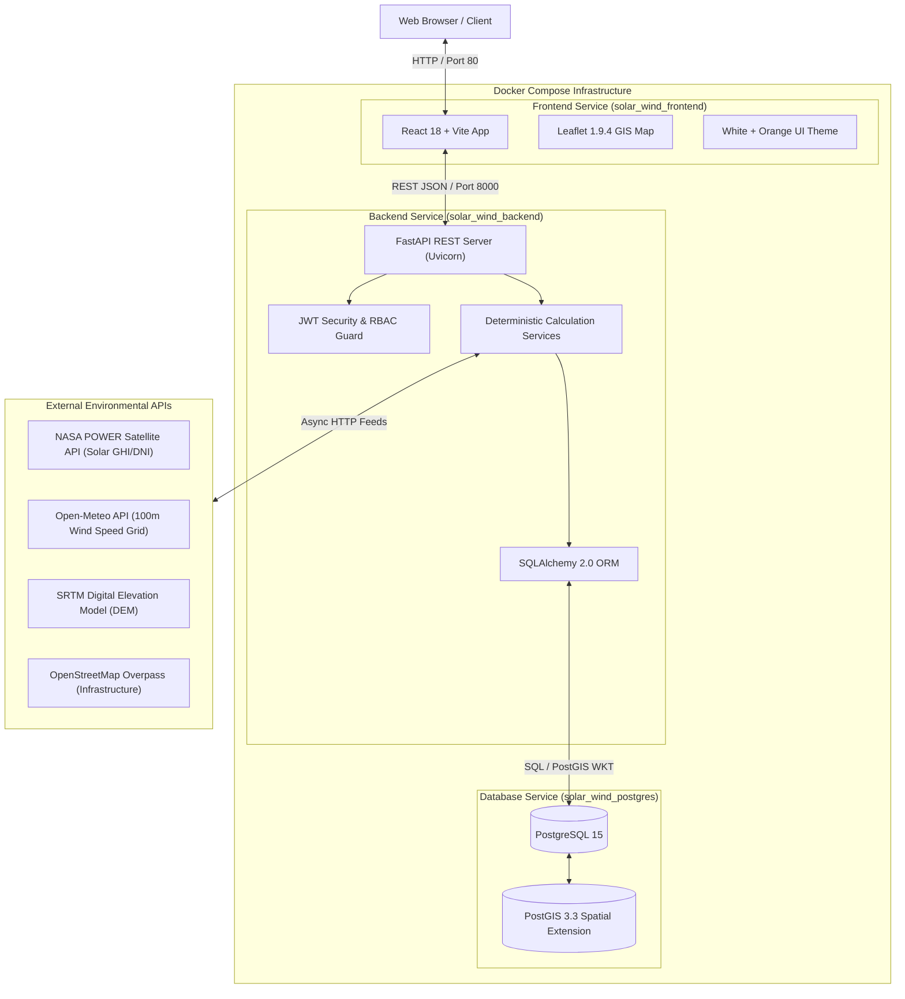

# Solar & Wind Deployment Intelligence Platform

> **100% Deterministic Engineering Physics & Spatial Analytics Engine (Zero AI / Zero Machine Learning)**

The **Solar & Wind Deployment Intelligence Platform** is an enterprise-grade web platform for renewable energy site evaluation, multi-criteria suitability scoring, energy yield forecasting, deployment optimization, technical report generation, and multi-site benchmarking.

---

## Overview

The platform is designed to assist renewable energy planners, GIS analysts, and project managers in identifying, cataloging, evaluating, and managing candidate deployment sites for utility-scale solar PV and wind turbine projects.

### Policy Statement: Deterministic Analytics Engine (Zero AI / ML)
This application relies strictly on **reproducible physics equations, geospatial vector queries (PostGIS), and multi-criteria decision analysis (MCDA)**. It intentionally does **NOT** use Artificial Intelligence (AI), Machine Learning (ML), Deep Learning, neural networks, or black-box predictive models. All calculations are 100% auditable and reproducible.

---

## Objectives

- **Centralized Project Lifecycle Management**: Manage regional renewable projects, target MW capacities, and budget allocations.
- **Candidate Site Registration**: Catalog candidate sites with precise geographic boundaries (latitude/longitude), land area, elevation, land ownership, and existing infrastructure.
- **PostGIS Spatial Storage**: Store site locations as native spatial geometry (`EPSG:4326` WGS84) with spatial indexing for fast spatial queries.
- **GIS Map Engine**: Interactive 10-layer spatial map overlay for basemaps, candidate site markers, road networks, substations, transmission lines, water bodies, protected areas, and setback buffer zones.
- **Multi-Source Environmental Integration**: Automated ingestion of solar irradiance (NASA POWER), 100m hub-height wind speed (Open-Meteo), digital elevation models (SRTM DEM), and infrastructure datasets (OpenStreetMap).

---

## Key Features

- **Authentication & Security**: Secure user registration, password hashing (bcrypt), and signed JWT access token validation.
- **Role-Based Access Control (RBAC)**: 4 distinct user roles with specific system permission scopes.
- **Project & Site Management**: Full CRUD operations for renewable energy projects and candidate sites with coordinate boundary validation.
- **Interactive GIS Spatial Map**: Leaflet 1.9.4 map engine supporting 10 vector layers, site marker popups, pan/zoom, and satellite imagery mode toggle.
- **Environmental Data Feeds**: Automated satellite and weather grid data retrieval for any candidate site location.
- **Solar & Wind Physics Analysis**: PV yield models and fluid dynamics wind power density ($P/A = \frac{1}{2} \rho v^3$) calculations.
- **5-Factor Site Suitability Index**: Multi-Criteria Decision Analysis (MCDA) scoring sites from 0–100 across Resource, Geographic, Infrastructure, Environmental, and Economic dimensions.
- **25-Year Energy & Revenue Forecasting**: Long-term degradation and tariff-based revenue projections.
- **Spatial MW Density Optimization**: Optimal turbine/panel array sizing considering terrain slope exclusions and 500m buffer zones.
- **Automated Report Exporter**: PDF (ReportLab) and Excel (`.xlsx`, OpenPyXL) report generation.
- **Multi-Site Benchmarking**: Side-by-side comparison across 18 physical and financial metrics for candidate sites.

---

## User Roles (RBAC Matrix)

The platform supports 4 user roles configured in PostgreSQL:

| Role | Access Level | Responsibilities & Permissions |
| :--- | :--- | :--- |
| **`ENERGY_PLANNER`** | Operational | Resource calculation, PV/wind yield modeling, suitability scoring, energy forecasting, and report export. |
| **`GIS_ANALYST`** | Spatial / Technical | Spatial layer ingestion, polygon boundary drafting, terrain slope analysis, buffer zone checks, and GIS map configuration. |
| **`PROJECT_MANAGER`** | Executive / Supervisory | Project lifecycle oversight, target capacity planning, budget tracking, team approvals, and investment recommendations. |
| **`ADMINISTRATOR`** | Global System | User account administration, role assignment (RBAC), external data source connection toggles, and audit log auditing. |

---

## Workflow

```
Landing Page
  ↓
User Registration
  ↓
Authentication & JWT Issuance
  ↓
Role-Based Dashboard
  ↓
Create Renewable Energy Project
  ↓
Create Candidate Site
  ↓
Coordinate Boundary Validation (-90..90, -180..180)
  ↓
PostGIS Spatial Storage (POINT[lon lat], SRID 4326)
  ↓
GIS Map Visualization (10 Layer Leaflet Overlay)
  ↓
Environmental Dataset Fetch (NASA POWER / Open-Meteo)
  ↓
Solar & Wind Physics Yield Analysis
  ↓
5-Factor Suitability Scoring & Ranking
  ↓
25-Year Energy & Revenue Forecast
  ↓
Spatial Deployment Optimization
  ↓
Technology & Payback Recommendation
  ↓
PDF & Excel Report Generation
```

> **Note**: Milestone 1 establishes the core foundation (Landing → Auth → RBAC → Dashboard → Project Management → Site Management → PostGIS Storage → GIS Map → Environmental Data Ingestion). The advanced analytical engines (Yield Analysis → Suitability → Forecasting → Optimization → Recommendations → Reports) represent later evaluation modules.

---

## Architecture



---

## Technology Stack

- **Frontend**: React 18, Vite 5.4.21, Tailwind CSS, Leaflet 1.9.4, Lucide Icons, Recharts, Axios.
- **Backend**: Python 3.12+, FastAPI, Uvicorn, SQLAlchemy 2.0, Pydantic v2, PyJWT, Passlib (bcrypt), ReportLab, OpenPyXL.
- **Database**: PostgreSQL 15 + PostGIS 3.3.4 Spatial Extension (`EPSG:4326` WGS84).
- **Infrastructure & Containerization**: Docker Desktop, Docker Compose, Nginx.

---

## Project Structure

```
Solar and Wind/
├── backend/
│   ├── app/
│   │   ├── api/v1/endpoints/   # FastAPI REST routers (auth, projects, sites, gis, etc.)
│   │   ├── core/               # App configuration, security, & DB session manager
│   │   ├── models/             # SQLAlchemy ORM models (19 schema tables)
│   │   ├── schemas/            # Pydantic data validation & request schemas
│   │   ├── services/           # Business logic, physics engines, & exporters
│   │   ├── __init__.py
│   │   └── main.py             # FastAPI entrypoint & middleware configuration
│   ├── tests/                  # Unittest & integration test suites
│   ├── Dockerfile              # Python 3.12 FastAPI Docker image definition
│   └── requirements.txt        # Python backend dependencies
├── database/
│   ├── Dockerfile              # PostGIS 3.3 image definition
│   └── init.sql                # PostgreSQL DDL script with PostGIS extensions & seeds
├── docs/
│   ├── architecture.md         # Detailed system architecture specification
│   └── workflow.md             # Complete step-by-step workflow guide
├── frontend/
│   ├── src/
│   │   ├── components/         # Common UI cards, badges, navbar, sidebar
│   │   ├── context/            # AuthContext JWT state provider
│   │   ├── pages/              # 27 Application page views & role dashboards
│   │   └── services/           # Axios API client & endpoint bindings
│   ├── dist/                   # Production build dist output
│   ├── nginx.conf              # Nginx web server configuration
│   ├── Dockerfile              # Multi-stage Vite + Nginx Docker build definition
│   └── package.json            # Node dependencies
├── .env.example                # Safe environment configuration template
├── .gitignore                  # Git repository exclusion rules
├── docker-compose.yml          # Container orchestration manifest
└── README.md                   # Platform documentation
```

---

## Prerequisites

- **Git**: Installed on developer environment.
- **Docker Desktop**: Docker engine and Docker Compose plugin installed and active.

---

## Installation & Setup

1. **Clone the Repository**:
   ```bash
   git clone <YOUR_GITHUB_REPOSITORY_URL>
   cd "Solar and Wind"
   ```

2. **Configure Environment Variables**:
   Copy `.env.example` to `.env`:
   ```bash
   cp .env.example .env
   ```
   *(Note: The default `.env.example` file contains pre-configured development defaults suitable for immediate local testing).*

---

## Run With Docker

Launch the complete containerized stack using Docker Compose:

```bash
docker compose build --no-cache
docker compose up -d
```

Check the status of running containers:
```bash
docker compose ps
```

Expected Output:
```text
NAME                  IMAGE                   COMMAND                  SERVICE    STATUS
solar_wind_backend    solarandwind-backend    "uvicorn app.main:ap…"   backend    Up (healthy)
solar_wind_frontend   solarandwind-frontend   "/docker-entrypoint.…"   frontend   Up (healthy)
solar_wind_postgres   solarandwind-postgres   "docker-entrypoint.s…"   postgres   Up (healthy)
```

---

## Open the Website

- **Frontend Application**: [http://localhost](http://localhost) (or [http://localhost:5173](http://localhost:5173))
- **Backend REST API Health**: [http://localhost:8000/api/v1/health](http://localhost:8000/api/v1/health)
- **Swagger Interactive API Docs**: [http://localhost:8000/docs](http://localhost:8000/docs)

---

## First-Time Usage Guide

1. Open **[http://localhost](http://localhost)** in your web browser.
2. Click **Register** in the top navigation bar to create a fresh account (e.g. `planner@example.com`).
3. Select your desired role (e.g. `ENERGY_PLANNER` or `ADMINISTRATOR`).
4. Log in to access the **Role-Based Dashboard**.
5. Navigate to **Projects** and click **Create Project** (e.g. Project Name: `Bhopal Renewable Energy Project`, Region: `Central India`).
6. Open your created project and click **Add Candidate Site**.
7. Enter candidate site specifications:
   - **Site Name**: `Bhopal Solar Site`
   - **Latitude**: `23.2599`
   - **Longitude**: `77.4126`
   - **Land Area**: `15.5`
   - **Elevation**: `505.0`
8. Click **Save Site** to persist the record into PostgreSQL/PostGIS.
9. Navigate to **GIS Map** (`/map`) to verify the candidate site marker rendering at coordinates `[23.2599, 77.4126]`.
10. Click the site marker to view spatial attributes in the Leaflet popup.
11. Navigate to **Environmental Data** to fetch NASA POWER and Open-Meteo telemetry.

---

## GIS & PostGIS Coordinate Conventions

The platform uses **Leaflet 1.9.4** on the frontend and **PostGIS 3** on the backend:

- **Frontend Leaflet Coordinates**: Expects `[latitude, longitude]` order (e.g., `[23.2599, 77.4126]`).
- **PostGIS Spatial Geometry WKT**: Expects `POINT(longitude latitude)` order according to OGC standards:
  ```sql
  ST_SetSRID(ST_MakePoint(77.4126, 23.2599), 4326)
  ```
- **Spatial Reference System**: `EPSG:4326` (WGS 84 coordinate reference system).

---

## Environmental Datasets Table

| Dataset | Data Provider | Purpose / Layer Type | Integration Status |
| :--- | :--- | :--- | :--- |
| **NASA POWER** | NASA Langley Research Center | Daily Global Horizontal Irradiance (GHI), DNI, temperature, rainfall, humidity, cloud cover | **IMPLEMENTED** |
| **Open-Meteo Wind Grid** | Open-Meteo Weather API | 100m Hub-height wind speed vectors ($v_{100m}$), wind direction, ambient pressure | **IMPLEMENTED** |
| **SRTM DEM** | NASA / USGS SRTM | Site elevation ASL (meters), terrain slope angle profiles | **IMPLEMENTED** |
| **OpenStreetMap Overpass** | OpenStreetMap Foundation | Road networks, electrical substations, transmission grid lines, water bodies, protected areas | **IMPLEMENTED** |
| **Copernicus Sentinel** | European Space Agency (ESA) | Satellite imagery base layer (selectable via map layer toggle control) | **CONFIGURED** |

---

## API Documentation

Swagger UI is hosted automatically by FastAPI at **[http://localhost:8000/docs](http://localhost:8000/docs)**.

### Core API Endpoints:
- `POST /api/v1/auth/register` — User Account Registration
- `POST /api/v1/auth/login` — User Authentication & JWT Issuance
- `GET /api/v1/projects` — List User Renewable Projects
- `POST /api/v1/projects` — Create New Renewable Project
- `POST /api/v1/projects/{project_id}/sites` — Add Candidate Site with PostGIS Geometry
- `GET /api/v1/analytics/gis-layers` — Fetch GeoJSON Spatial Layers for Leaflet Map
- `GET /api/v1/environmental/data-sources/health` — External Data Sources Health Check
- `POST /api/v1/sites/{site_id}/environmental-data/fetch` — Trigger Satellite Data Ingestion

---

## Testing & Verification

The backend includes a comprehensive suite of automated tests. Run them from the project root:

```bash
# 1. Platform Router & Authentication Tests
python backend/tests/test_platform.py

# 2. PostGIS Geometry Storage & Coordinate Validation Tests
python backend/tests/test_postgis_site_creation.py

# 3. Wind Power Density Physics Calculation Tests
python backend/tests/test_wind_calculation.py

# 4. Math & Weighted Scoring Unit Tests
python backend/tests/run_tests.py

# 5. Integration Suite
python backend/tests/run_integration_tests.py

# 6. Real End-to-End Platform Lifecycle Test
python backend/tests/run_end_to_end_test.py
```

---

## Milestone 1 Summary

**Milestone 1 Scope**: Fully verified and demonstrable. Covers project initialization, architecture, PostGIS database setup, White + Orange frontend UI, FastAPI backend, JWT authentication, 4-tier RBAC, project management, candidate site cataloging, Leaflet GIS map engine, and environmental API data ingestion.

---

## Later Modules Summary

The codebase also contains functional modules for later evaluation phases:
- **Solar & Wind Analysis Engines**: Physical yield equations for solar PV and 100m wind density.
- **Site Suitability Index**: 5-factor weighted MCDA scoring (0–100) and suitability categories.
- **Energy & Revenue Forecasting**: 25-year generation decay and tariff projections.
- **Deployment Optimization**: MW density optimization considering terrain exclusions.
- **Investment Recommendations**: Payback period and technology selection algorithms.
- **Technical Reports Exporter**: Styled binary PDF and Excel workbook exports.
- **Multi-Site Benchmarking**: Side-by-side site comparison matrix.

---

## Troubleshooting Guide

### 1. Check Container Health
```bash
docker compose ps
```

### 2. View Service Logs
```bash
# Backend logs
docker compose logs backend

# Frontend logs
docker compose logs frontend

# Database logs
docker compose logs postgres
```

### 3. Restart Containers
```bash
docker compose down
docker compose up -d
```

### 4. Blank GIS Map Fix
If the GIS map appears blank white upon navigation, ensure that `http://localhost` is being served by the latest Nginx build container. Perform a hard refresh (`Ctrl + Shift + R`) to update browser-cached assets.

---

## Security Guidelines

- **`.env` Exclusion**: Never commit your active `.env` file to Git.
- **`.env.example`**: Keep safe placeholder values in `.env.example` for public distribution.
- **JWT Key**: Always change `SECRET_KEY` in production environments.

---

## License

**License**: Not specified / Academic Project.
