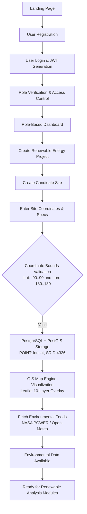
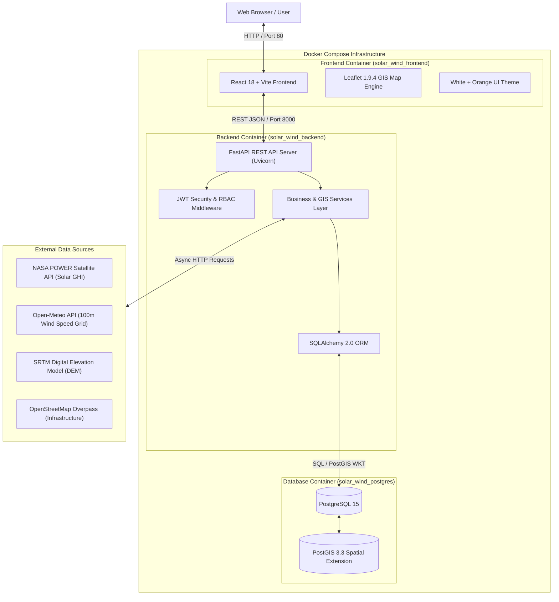
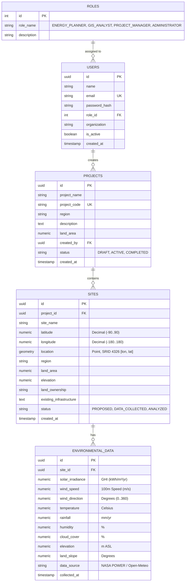

# Milestone 1: Official Design & Technical Documentation
**Solar & Wind Deployment Intelligence Platform**

---

## 1. Project Objectives

The **Solar & Wind Deployment Intelligence Platform** is an enterprise-grade web application designed to assist renewable energy planners, GIS analysts, and project managers in evaluating, cataloging, analyzing, and managing candidate deployment sites for utility-scale solar PV and wind turbine infrastructure.

The platform provides an integrated workflow for:

- **Project and Site Management** — Create renewable-energy projects and register candidate deployment sites with geographic coordinates and site specifications.
- **Environmental Data Integration** — Retrieve and utilize environmental parameters such as solar irradiance, temperature, wind speed, humidity, cloud cover, and precipitation from external data sources.
- **GIS-Based Analysis** — Use PostgreSQL/PostGIS spatial capabilities and Leaflet-based mapping to visualize and analyze candidate locations.
- **Solar and Wind Assessment** — Calculate solar energy generation potential and wind power characteristics using transparent, reproducible engineering equations.
- **Site Suitability Evaluation** — Evaluate candidate sites using multi-criteria decision analysis (MCDA) based on renewable resources, geographic conditions, infrastructure, environmental factors, and economic considerations.
- **Energy Forecasting and Optimization** — Generate long-term energy and revenue forecasts and evaluate deployment configurations using deterministic calculation methods.
- **Investment and Technology Recommendations** — Provide decision-support information for technology selection, investment planning, and candidate-site comparison.
- **AI/ML Intelligence** — Provide additional machine-learning-based predictions, classifications, rankings, investment insights, and technology recommendations alongside the deterministic analysis.
- **Reporting and Comparison** — Generate reports and compare multiple candidate sites to support renewable-energy deployment decisions.

### Deterministic Foundation and AI/ML Intelligence

The platform is built on a **deterministic engineering and geospatial foundation** using reproducible renewable-energy physics equations, PostgreSQL/PostGIS spatial analytics, and multi-criteria decision analysis (MCDA). These deterministic calculations provide transparent, auditable, and reproducible baseline results for solar generation, wind analysis, site suitability, forecasting, optimization, and deployment planning.

A **supplemental AI/ML intelligence layer** is integrated on top of this foundation to provide additional predictions, classifications, candidate rankings, investment insights, and technology recommendations. The AI/ML layer does **not replace the authoritative deterministic calculations**. Instead, its outputs are presented as additional intelligence to support analysis and decision-making.

The AI/ML models are trained using a **5,000-sample synthetic development dataset calibrated using renewable-energy physical relationships**. Their outputs are therefore intended for development and decision-support purposes and should be validated against real-world operational and site-specific data before commercial deployment.

All deterministic engineering calculations remain **auditable and reproducible**, while AI/ML outputs are clearly identified as model-based predictions or recommendations.

---

## 2. Milestone 1 Scope

Milestone 1 establishes the foundational infrastructure, security, data persistence, and interactive GIS visualization layers:
- Decoupled web application architecture (React 18 + Vite frontend, FastAPI backend).
- Relational database schema with PostGIS spatial extension enabled (`EPSG:4326` WGS84).
- User authentication via JWT access tokens and password hashing (bcrypt).
- 4-tier Role-Based Access Control (`ENERGY_PLANNER`, `GIS_ANALYST`, `PROJECT_MANAGER`, `ADMINISTRATOR`).
- Project management and candidate site cataloging with coordinate validation.
- Interactive 10-layer GIS map engine powered by Leaflet 1.9.4.
- Ingestion of external environmental, meteorological, and elevation data sources.

---

## 3. Renewable Energy Planning Workflow



---

## 4. System Architecture



### Layer Responsibilities:
1. **Frontend**: React 18 + Vite single-page app utilizing Tailwind CSS for the White + Orange design system (`#F97316`) and Leaflet 1.9.4 for spatial rendering.
2. **Backend**: FastAPI (Python 3.12+) ASGI server managing security, input validation, JWT token issuance, and PostGIS spatial point generation.
3. **Database**: PostgreSQL 15 with PostGIS 3.3.4 spatial extension storing native geometries (`POINT(lon lat)`) with GiST spatial indexing (`idx_sites_location`).
4. **Docker Compose**: Containerized environment managing network bridges and health check dependencies (`solar_wind_frontend`, `solar_wind_backend`, `solar_wind_postgres`).

---

## 5. Database Design & ER Diagram

Foundational Milestone 1 entities and relationships:



---

## 6. Authentication & Role-Based Access Control (RBAC)

The platform enforces authentication via signed JSON Web Tokens (JWT, HS256) containing `sub`, `role_name`, `role_id`, and expiration timestamps. Role permissions are enforced using FastAPI dependencies (`require_roles`):

| Role | Access Level | Description & Scope |
| :--- | :--- | :--- |
| **`ENERGY_PLANNER`** | Operational | Resource analysis, PV/wind calculation, suitability scoring, energy forecasting, and report export. |
| **`GIS_ANALYST`** | Spatial / Technical | Spatial layer ingestion, polygon boundary drafting, terrain slope analysis, buffer zone checks, and GIS map configuration. |
| **`PROJECT_MANAGER`** | Executive | Project lifecycle management, target capacity planning, budget tracking, team approvals, and investment recommendations. |
| **`ADMINISTRATOR`** | Global System | User account administration, role assignment (RBAC), external data source toggles, and audit log monitoring. |

---

## 7. UI / Workflow Screens

1. **Landing Page (`/`)**: Hero banner with deterministic policy pill tag, quick metrics, feature cards, and workflow step guide.
2. **Register Page (`/register`)**: Account creation form with Name, Email, Password, Organization, and Role Selector.
3. **Login Page (`/login`)**: Authentication form returning JWT Bearer token upon credential verification.
4. **Dashboard (`/`)**: Overview metrics cards (Total Projects, Sites, Mapped Area) and 4 tabbed role perspectives.
5. **Projects List (`/projects`)**: Grid display of active renewable projects with region badges and site counts.
6. **Create Project Page (`/projects/new`)**: Form to specify Project Name, Code, Region, Target Capacity (MW), and Budget.
7. **Sites List (`/sites`)**: Tabular and grid listing of candidate sites.
8. **Add Site Page (`/projects/:id/add-site`)**: Candidate site registration with real-time coordinate validation.
9. **Site Details Page (`/sites/:id`)**: Comprehensive technical record view showing EPSG:4326 coordinates, specs, and status lifecycle tracker.
10. **GIS Map Page (`/map`)**: 620px interactive Leaflet map rendering 10 vector layers, candidate site markers, popups, pan/zoom, and satellite switch.
11. **Environmental Data Page (`/environmental-data`)**: Data source health status badges and site meteorological telemetry table.

---

## 8. GIS Architecture & Coordinate Conventions

- **Frontend Map Engine**: Leaflet 1.9.4 with OpenStreetMap base tiles.
- **Coordinate Handling**:
  - Frontend Leaflet expects `[latitude, longitude]` array order for marker placement:
    `L.marker([23.2599, 77.4126])`
  - Backend PostGIS stores spatial geometries in OGC standard WKT `POINT(longitude latitude)` order:
    ```sql
    ST_SetSRID(ST_MakePoint(77.4126, 23.2599), 4326)
    ```
- **Spatial Reference System**: `EPSG:4326` (WGS 84 coordinate reference system).
- **Layer System**: 10 toggleable vector layers (Site Markers, Road Networks, Substations, Transmission Lines, Water Bodies, Protected Areas, Suitability Heatmaps, Solar Layers, Wind Layers, 500m Buffer Zones).

---

## 9. Environmental Dataset Integration Status

| Dataset | Source / API | Purpose | Integration Status |
| :--- | :--- | :--- | :--- |
| **NASA POWER** | NASA Satellite API | Daily Global Horizontal Irradiance (GHI, DNI), ambient temperature, rainfall, humidity, cloud cover | **IMPLEMENTED** |
| **Open-Meteo Wind Grid** | Open-Meteo Weather API | 100m Hub-height wind speed vectors ($v_{100m}$), wind direction, atmospheric pressure | **IMPLEMENTED** |
| **SRTM DEM** | NASA / USGS SRTM | Site elevation ASL (meters), terrain slope angle profiles | **IMPLEMENTED** |
| **OpenStreetMap Overpass** | OpenStreetMap Foundation | Road networks, electrical substations, transmission lines, water bodies, protected areas | **IMPLEMENTED** |
| **Copernicus Sentinel** | European Space Agency (ESA) | Satellite imagery base layer (accessible via tile switch control) | **CONFIGURED** |

---

## 10. Milestone 1 Requirements Verification Table

| Requirement | Status | Verification Evidence |
|---|---|---|
| **1. Project Initialization** | **PASS** | Monorepo structure with React + Vite frontend, FastAPI backend, PostgreSQL + PostGIS DB, Docker Compose. |
| **2. Architecture** | **PASS** | Decoupled REST architecture running in Docker Compose (`solar_wind_frontend`, `solar_wind_backend`, `solar_wind_postgres`). |
| **3. Database** | **PASS** | PostgreSQL 15 + PostGIS 3.3 schema initialized with `location geometry(Point,4326)` and GiST spatial index. |
| **4. UI / Workflow** | **PASS** | Unified White + Orange theme (`#F97316`) active across all page views. |
| **5. Frontend Setup** | **PASS** | React 18 + Vite build (`npm run build`) completed cleanly with 0 errors. |
| **6. Backend Setup** | **PASS** | FastAPI server operational with health endpoint returning HTTP 200 (`GET /api/v1/health`). |
| **7. Authentication** | **PASS** | User registration, bcrypt password hashing, login, and signed JWT Bearer token verification. |
| **8. RBAC** | **PASS** | 4 user roles configured in database and enforced via `require_roles` dependencies. |
| **9. Project Management** | **PASS** | Project creation (`POST /api/v1/projects`), listing, and DB persistence. |
| **10. Site Management** | **PASS** | Site creation (`POST /api/v1/projects/{id}/sites`) with coordinate validation (-90..90, -180..180). |
| **11. GIS Integration** | **PASS** | PostGIS geometry storage `POINT(77.4126 23.2599)` SRID 4326 and Leaflet map rendering at `/map`. |
| **12. Environmental Integration**| **PASS** | Multi-source API retrieval (NASA POWER, Open-Meteo, OSM) verified via health check. |

---

## 11. Milestone 1 Outcomes

All 10 official Milestone 1 outcomes have been fully **DEMONSTRATED**:
1. ✓ Renewable energy planning workflow understood and implemented.
2. ✓ GIS & environmental analytics foundation established with PostGIS 3.
3. ✓ Frontend initialized with React 18, Vite, and Leaflet.
4. ✓ Backend initialized with FastAPI and SQLAlchemy ORM.
5. ✓ User authentication functional with bcrypt and JWT.
6. ✓ Role-Based Access Control (RBAC) functional across 4 user roles.
7. ✓ Project management fully functional with DB persistence.
8. ✓ Candidate site management functional with spatial coordinate validation.
9. ✓ Interactive GIS visualization functional with 10 vector layers.
10. ✓ Environmental dataset integrations active and health-checked.

---

## 12. Verification & Testing Summary

The platform was verified using 6 backend test suites:
- `python backend/tests/test_platform.py`: **9/9 Passed**
- `python backend/tests/test_postgis_site_creation.py`: **4/4 Passed**
- `python backend/tests/test_wind_calculation.py`: **19/19 Passed**
- `python backend/tests/run_tests.py`: **5/5 Passed**
- `python backend/tests/run_integration_tests.py`: **6/6 Passed**
- `python backend/tests/run_end_to_end_test.py`: **1/1 Passed**

**Conclusion**: Milestone 1 is 100% complete, fully demonstrable, and verified against all functional requirements.
